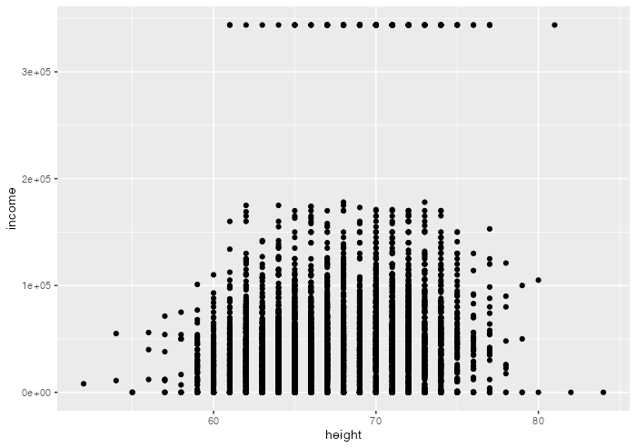
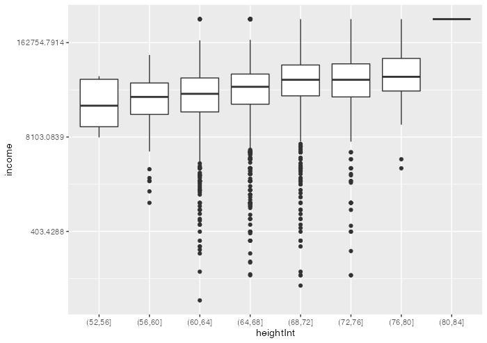
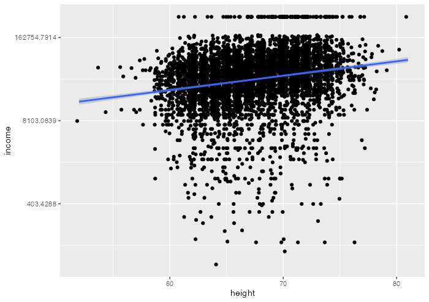
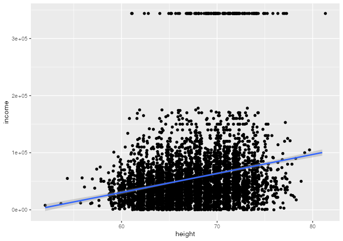
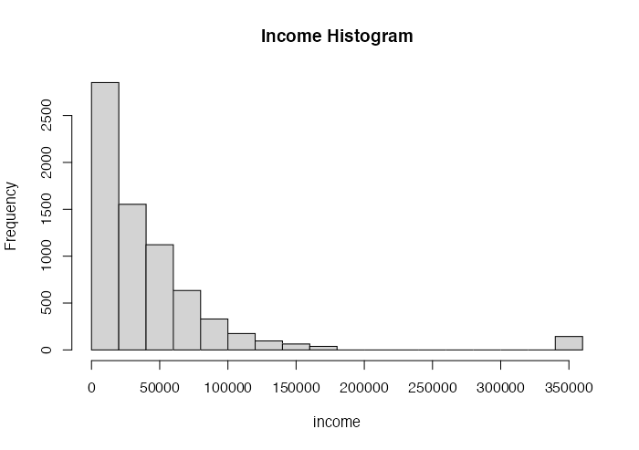

# Innledning

# Statistikk

Innledende tekst til oppgave 2

Hvor mye tjener vi pr ekstra inch?

En ekstra inxh (2,72cm) gir oss \$2982 ekstra i inntekt pr år.

Er det mer til historien?

# Oppgave 2 - Hoyde

# Innledning

1.  Beskrivende statistikk , dvs. kort beskrivelse av dataene

2.  Lag et histogram av variabelen income

2.1 Hva er forklaringen på utliggerne langt til høyre?

Grunnen til at det ligger en søyle helt til høyre er på grunn av at det
er en andel personer i utvalget som har en vesentlig høyere inntekt enn
det resterende utvalget. ut i fra histogrammet kan vi se at fleste
tjener under 50000.

2.2 Har vi personer uten inntekt i datasettet?

Det finnes en andel personer uten inntekt.

# Regresjonsanalyse

# Resultat

# Konklusjon

Er det høyde som bestemmer inntekt?

# Litteraturgjennomgang

# Referanser
